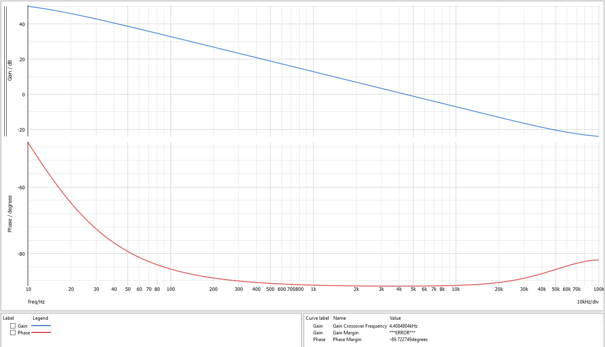

# Tiny-Nixie-Flyback-Converter
### Galvanically isolated multi-output flyback converter, specifically designed for Nixie clocks to ensure safe operation.

## Project Overview
The power supply provides full galvanic isolation for the Nixie tubes and their control circuitry.
Technical specifications of the power supply:
- Input voltage range: 4.5 V – 13 V
- Output voltage 1: 170 V (for the Nixie tubes)
- Output voltage 2: 3.3 V (for the control circuitry)
- Output current 1: 20 mA
- Output current 2: 50 mA
- Maximum duty cycle: 0.85
- Switching frequency: 300 kHz
- Current-mode control without slope compensation
- Type II compensation
- Galvanic isolation of feedback using an opto-emulator
- Custom EFD-15 transformer
- 100% DCM operation
- Hiccup-mode overcurrent protection
- soft start

# Simulating with SIMPLIS
## Open loop Transfer function ($U_i$ = 5 V @ full load)

