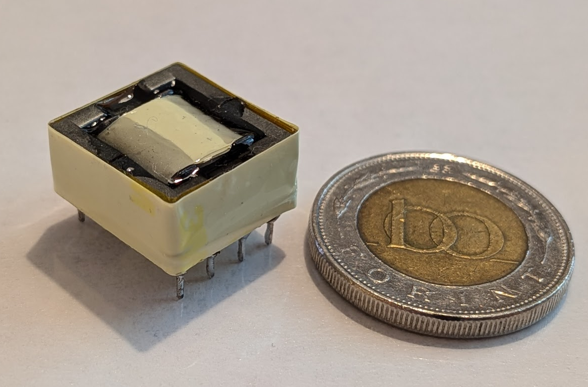
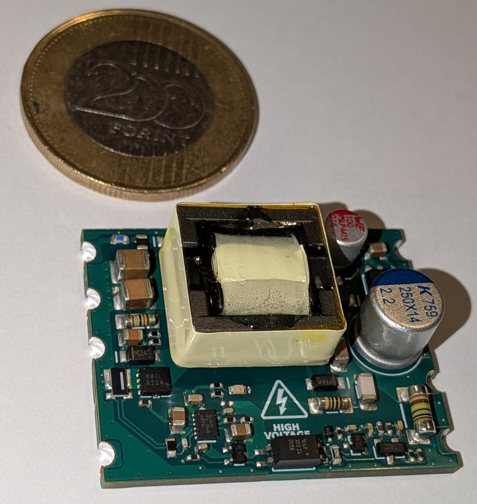
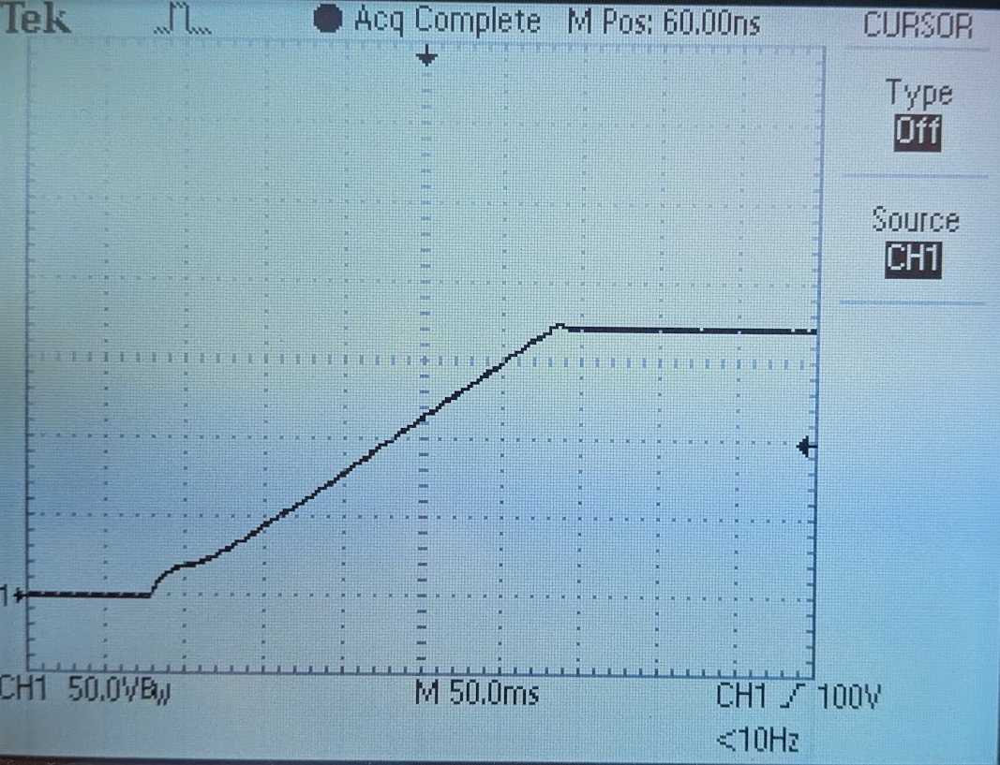
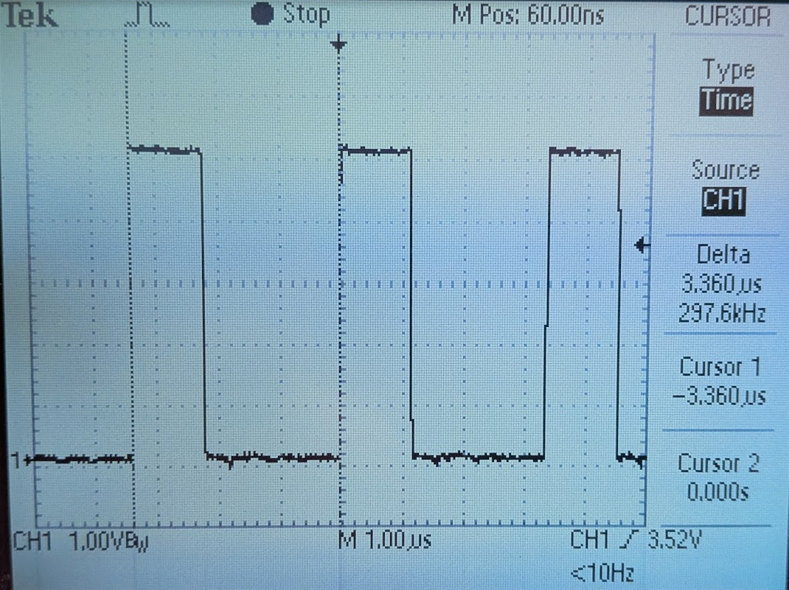
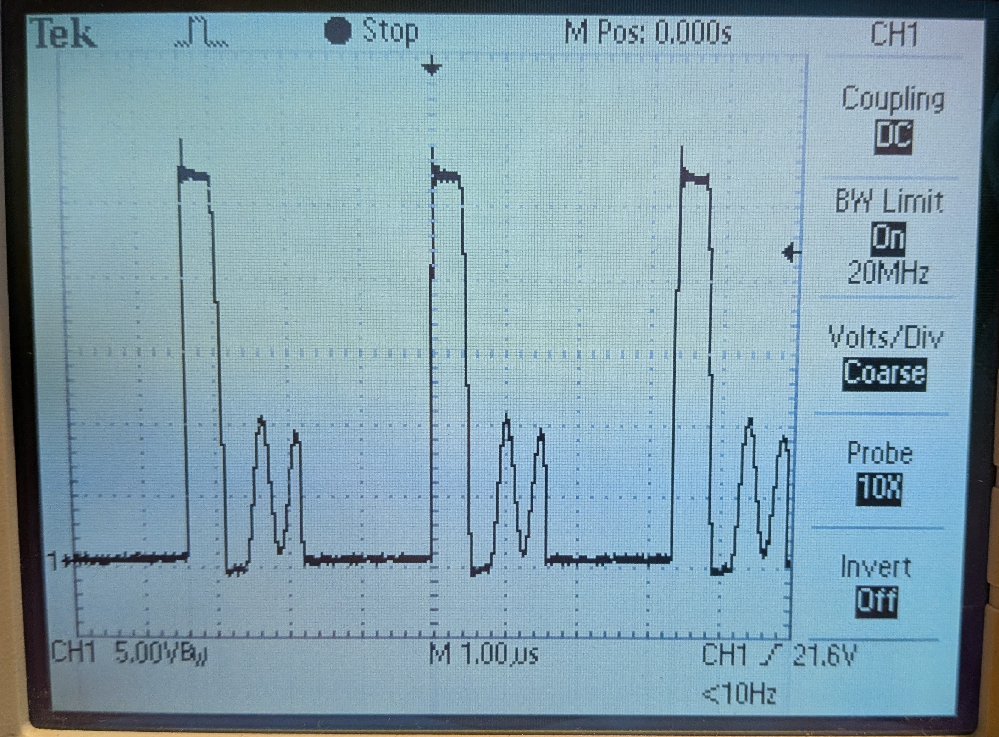

# Tiny-Nixie-Flyback-Converter
### Galvanically isolated multi-output flyback converter, specifically designed for Nixie clocks to ensure safe operation.

# Table of Contents
- [Project Overview](#project-overview)
- [Simulating with SIMPLIS](#simulating-with-simplis)
  - [Simulation model](#simulation-model)
  - [Transient simulation](#transient-simulation)
  - [Open loop Transfer function)](#open-loop-transfer-function)
  - [Closed loop Transfer function)](#closed-loop-transfer-function)
  - [No-Load Closed loop Transfer function)](#no-load-closed-loop-transfer-function)
- [Designed with Altium Designer](#designed-with-altium-designer)
  - [Schematic](#schematic)
  - [4-layer PCB](#4-layer-pcb)
- [Custom Designed Transformer](#custom-designed-transformer)

# Project Overview
The power supply provides full galvanic isolation for the Nixie tubes and their control circuitry.
Technical specifications of the power supply:
- Input voltage range: 4.5 V – 13 V
- Output voltage 1: 170 V (for the Nixie tubes)
- Output voltage 2: 3.3 V (for the control circuitry)
- Output current 1: 20 mA
- Output current 2: 50 mA
- Maximum duty cycle: 0.85
- Switching frequency: 300 kHz
- Current-mode control without slope compensation
- Type II compensation
- Galvanic isolation of feedback using an opto-emulator
- Custom EFD-15 transformer
- 100% DCM operation
- Hiccup-mode overcurrent protection
- Soft start
- UVLO

# Simulating with SIMPLIS
## Simulation model

## Transient simulation
$U_i$ = 5 V @ full load

## Open loop Transfer function
$U_i$ = 5 V @ full load

## Closed loop Transfer function
$U_i$ = 5 V @ full load

## No-Load Closed loop Transfer function
$U_i$ = 5 V @ no load

# Designed with Altium Designer
## Schematic

## 4-layer PCB
PCB Size: 30 mm X 37 mm

# Custom Designed Transformer
The power supply also includes a custom-designed flyback transformer on an EFD-15/8/5 core. The winding layers are arranged in a sandwich configuration. 
Key parameters:

- $N_p$ / $N_{s1}$ = 7/56
- $N_p$ / $N_{s2}$ = 7/3
- $L_p$ = 2.483 uH
- $L_{p.leak}$ = 43 nH
- $L_{s1.leak}$ = 3.12 uH
- $B_{max}$ < 0.1 T
- $P_{loss}$ < 0.2 W

# Assembled PCB

# Measurements
## Startup Under Full Load Conditions

## MOSFET gate measurements
The MOSFET gate waveform shows neither overshoot nor ringing. The gate resistor appears to be optimal.

## SW Node measurements (Mosfet drain measurements)
The SW node shows minimal overshoot at full load condition, with no ringing observed. The low-frequency oscillation is characteristic of DCM operation.

